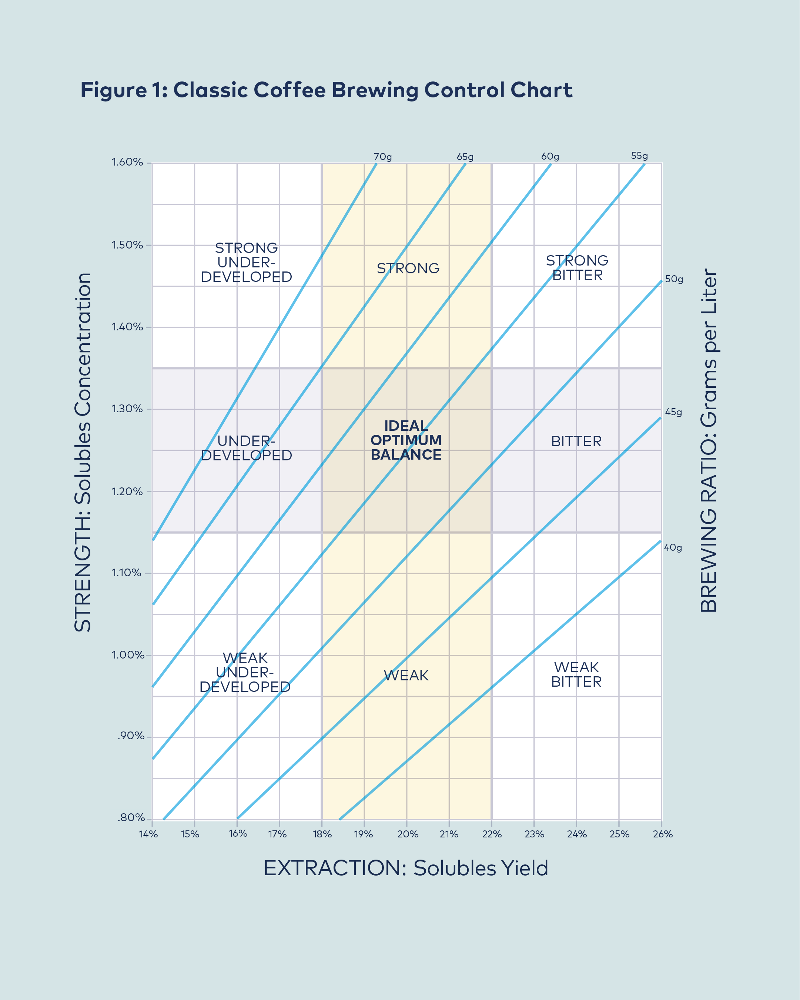
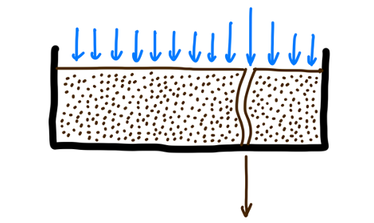
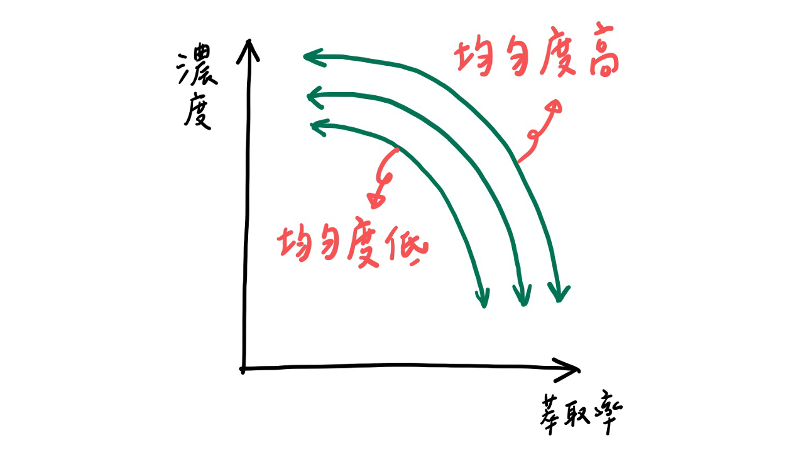
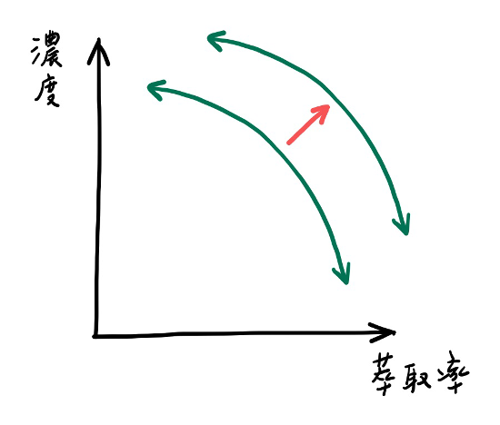
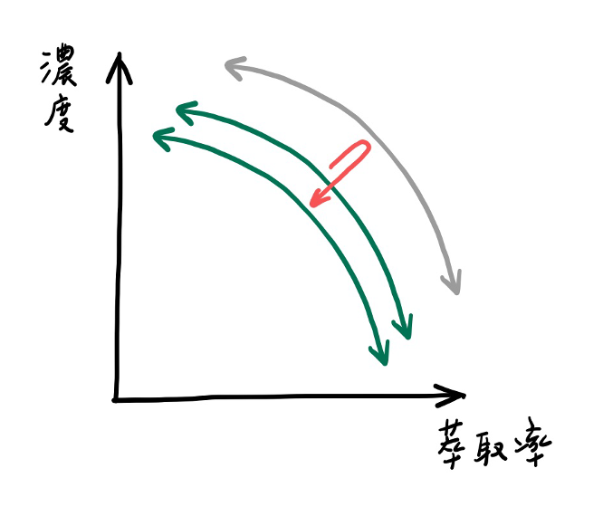
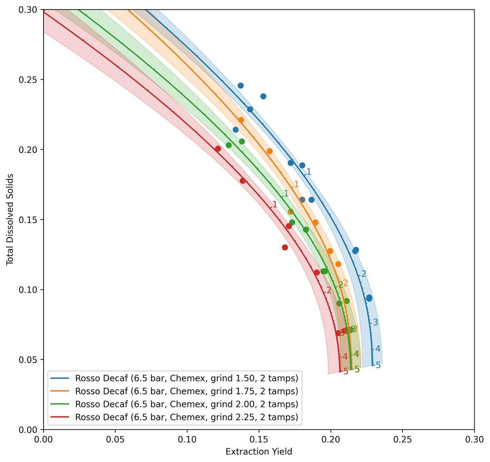
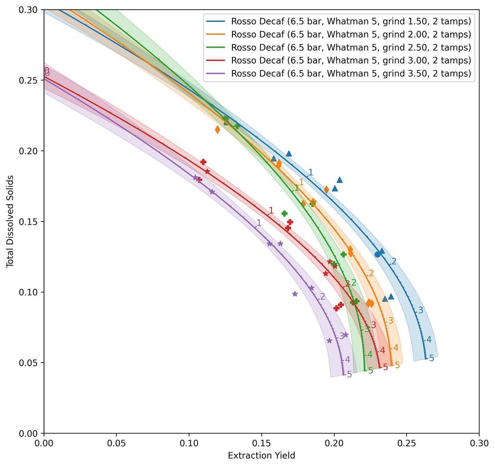
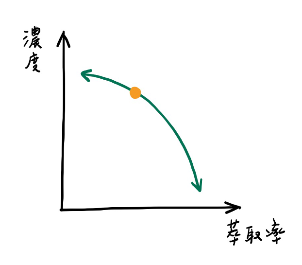
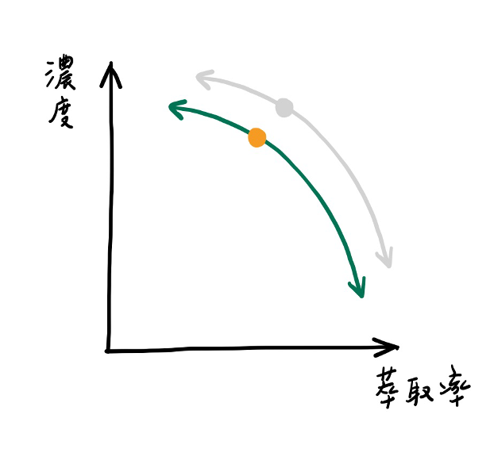
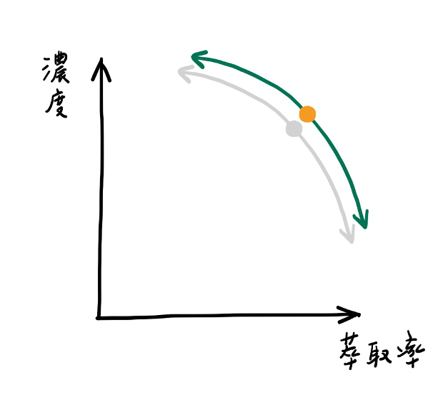

# 萃取理論：義式修正
顧問 翁浩永

---

# Some Shameless Advertising!

---

# 節錄

> 風味是主觀的，對咖啡的偏好自然也是主觀的。
> 
> 然而許多時候我們還是會需要一些客觀的數據，不只有利於同好間的溝通與交流，也有助於我們調整參數，改善一杯不好喝的咖啡。
> 
> 過去這三年間，在上每學期台大咖啡社的沖煮理論課程時，我總是以咖啡那些「客觀」的數據開始說起，更準確來說，TDS（也就是一種濃度的指標）與萃取率。

---

# 一些（客觀的）數據

## 濃度 (TDS, Total dissolved solids)
## 萃取率 (EY, Extraction Yield)

---

# 濃度（Strength）

我們一般來說使用 TDS，即 total dissolved solids，來表示咖啡的濃度。

就定義上來說，TDS 即是咖啡液中所包含的咖啡物質重量 $(M_{bev})$ 除以咖啡液重 $(B)$。

 

$$ \mathrm{TDS} = \frac{M_{bev}}{B} $$

 

舉例來說，若我們知道一杯 100g 的咖啡中包含 1.4g 的咖啡物質（假設我們把咖啡拿去烤箱烤乾，結果剩下 1.4g 的咖啡固體），則 TDS 為 1.4%。

---

# 萃取率（EY, Extraction Yield）

萃取率的定義則為咖啡液中所包含的咖啡物質重量 $(M_{bev})$ 除以使用咖啡的重量 $(D)$。

 

$$ \mathrm{EY} = \frac{M_{bev}}{D} = \frac{\mathrm{TDS} \times B}{D}$$

 

舉例來說，我們用 10g 的咖啡豆沖煮了一杯 170g、TDS 為 1.4% 的咖啡，則萃取率為：

 

$$ \mathrm{EY} = \displaystyle\frac{1.4\%*170g}{10g} = 23.8\%$$

---

# 這些數據如何影響咖啡？

## 濃度
影響口感、黏稠度

## 萃取率
影響風味、酸甜比例

---

# 為什麼萃取率會影響酸甜比例？
因為不同物質之間萃取速率不同

---

---

# 萃取率與風味
## 萃取不足（Under-Extracted）
尖酸、複雜度不足
## 萃取適當
甜、複雜
## 萃取過度（Over-Extracted）
苦、澀

---

---

# 萃取過度（過萃）真的存在嗎？
## i.e. 紅線在哪？

2013 年我們曾經覺得紅線在 20%，現在我們覺得紅線在 26%。

當然，這是在生豆與烘焙品質良好的情況下。

---

# Why?

因為萃取不夠均勻。

過度萃取的不良風味（苦、澀）更多時候來自萃取不均，而非整體的萃取過度。

---

# Why?

2013 年時我們的萃取是綠線，因此平均萃取率 20% 時就產生了不良風味。

今年我們則是在藍線上。

---

# 請盡量少講「過萃」
（當然，除非你已經萃了超過 25%）

---

# 台大咖啡社的目標
1. 均勻萃取
2. 高萃取
3. 不要跟外面的咖啡館吵架

---

# 均勻萃取也有助於提升萃取！

這也讓高萃取率有了另一個好處：
我們永遠無法得知萃取的均勻程度，但高萃取時萃取通常更均勻。

---

# 通道效應

一個萃取不均勻的特例，通常導致萃取率下降。

使用無底把手可以檢查是否存在嚴重的通道（不這麼嚴重的檢查不到，這也造成了另一個盲點，我們分區的時候會講）。

---

# 開始萃取！

---

# 操縱變因
1. 粉水比 (21 in, 45 out)
   - 粉重 (21g)
   - 濃縮重 (45g)
2. 研磨度 (901N #2.8)
3. 壓力 (9 bar)
4. 水溫 (92°C)
5. 烘焙程度 (淺焙)

---

# 應變變因

1. 濃縮
   - 好不好喝？
   - 濃度（TDS）
   - 萃取率（EY）
2. 萃取時間
   - 因為粉水比已經固定下來，因此萃取時間我們無法直接控制。

---

# Disclaimer

## 義式很難！

我們做的是所謂的 Old School 的義式

特徵：Bimodel 的磨豆機、沒有 pressure profiling（使用 9 bar）、中焙以上、粉水比 1:3 以內、萃取率不太高

以下所講的觀念應不至於有大問題，但絕對的數字可能並不這麼有參考價值。

---

# 首先，先講那些我們不動的變因

## 壓力（9 bar）
我們的機器不太容易調整。

## 水溫（92°C）
帶來的效應相對複雜，且我們還沒有完全了解，通常會先固定住。

--- 

# 粉水比（粉重）

### 粉量增加：
萃取率下降（酸值上升）、濃度上升（口感變厚）

### 粉量減少：
萃取率上升（甜感上升）、濃度下降（口感變薄）

### 注：
1. 一般來說與使用的 basket 尺寸有關，因此通常會在一開始就固定住，不再改動。
2. 也會影響流速，但效應較小。

---

# 粉水比（液重）

### 液重增加：
萃取率上升（甜感上升）、濃度下降（口感變薄）

### 液重減少：
萃取率下降（酸值上升）、濃度上升（口感變厚）

---

# 萃取率對濃度圖

---

# REVIEW: 均勻萃取也有助於提升萃取！

這也讓高萃取率有了另一個好處：
我們永遠無法得知萃取的均勻程度，但高萃取時萃取通常更均勻。

---

---

# 均勻萃取的重要性

在均勻度相同的情況，修改參數的作用基本上只是萃取率與濃度的互相取捨。

也因此，提高均勻度仍然是提高萃取率最好（也最困難）的方法之一。

---

# 研磨度
磨細 & 磨粗

---

# 研磨度
萃取率──濃度曲線不會無止盡的往右上走，會有能抵達的極限位置，接下來便會往反方向移動。

---

# 研磨度
咖啡粉過細時通道效應就會主宰濃縮的風味，也導致萃取率下降。
（或者更好的說法會是，有效的萃取表面積下降）

---

# 研磨度
我們可以藉由觀測「萃取時間」，來避免這種情況。

**萃取時間過長時，應適當磨粗。**

一般來說，會選用萃取時間落在正常範圍內（25–30s）的顆粒度當成調整的起始顆粒度。

### 注：
許多更為「先進」的義式參數則以約 15s 當成標準。

---

# 真實世界的數據
藍色為最細、紅色最粗

(source: IG, @quantitativecafe)

---

# 真實世界的數據
藍色為最細、紫色最粗
（觀察左上角的錯置）

(source: IG, @quantitativecafe)

---

# 烘焙程度
與選用的豆子有關，一般來說，烘得越淺的豆子越需要萃取，但卻也越難萃取。

也因此，淺烘焙豆子的參數通常粉水比較低（水較多），顆粒度也較細。

---

# 實驗
有人送了台大咖啡社一包水洗衣索比亞

---

# 嘗試修正

### 初始參數
- 粉量：20 g
- 總重：40 g
- 研磨刻度：2.8
- 萃取時間：25 秒

**酸值刺激、甜感不足、尾韻短**

---

# 嘗試修正

### 磨細
- 粉量：20 g
- 總重：40 g
- 研磨刻度：2.6
- 萃取時間：29 秒

**甜感有增強但依然不足、酸值高、尾韻長**

---

# 嘗試修正

### 再磨細
- 粉量：20 g
- 總重：40 g
- 研磨刻度：2.3
- 萃取時間：43 秒

**明顯苦感、酸值更高了**

---

# 嘗試修正

### 調回原本的研磨度、增加液重
- 粉量：20 g
- 總重：45 g
- 研磨刻度：2.6
- 萃取時間：31 秒

**甜感突出、酸值依然強但不致太過刺激**

---

# 嘗試修正

### 改善佈粉、使萃取更加均勻
- 粉量：20 g
- 總重：45 g
- 研磨刻度：2.6
- 萃取時間：32 秒

**酸值強但不刺激、甜感好、尾韻長**

---

# 修正完成！

---

# 在修正的過程 最重要的是⋯⋯

---

# 喝！